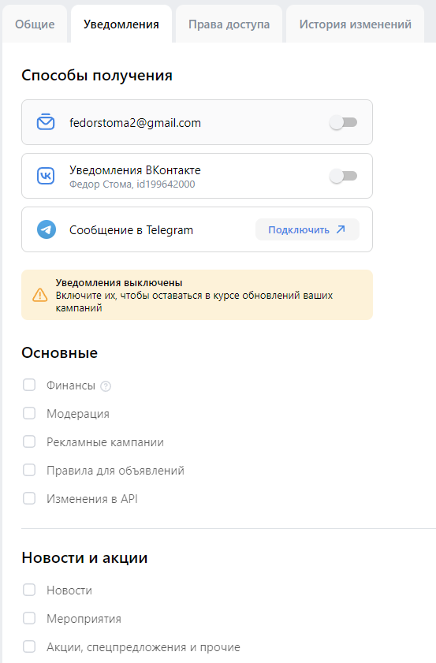
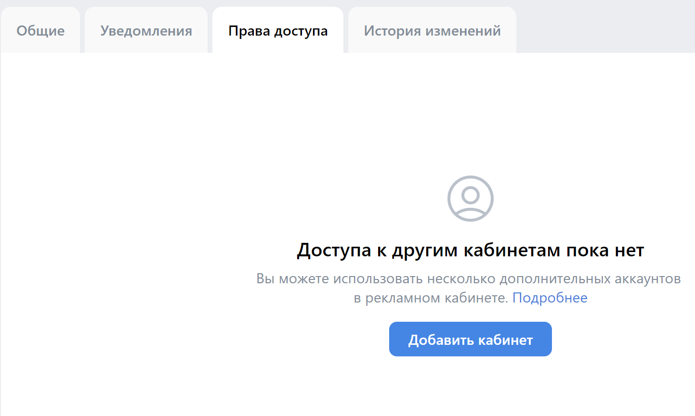
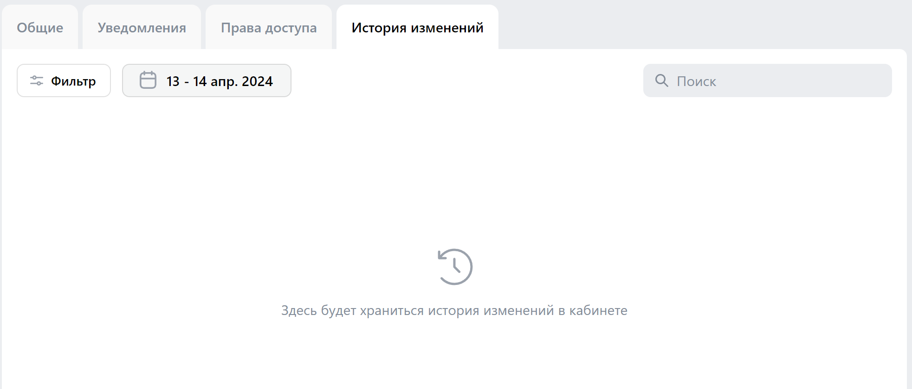

# Чек-листы ads.vk.com

## [Регистрация](https://ads.vk.com/hq/registration)

- При нажатии на `Создать новый кабинет` происходит переход на страницу регистрации кабинета ([https://ads.vk.com/hq/registration/new](https://ads.vk.com/hq/registration/new))
- При нажатии на `Использовать рекламный кабинет myTarget` происходит переход на страницу авторизиции в кабинет myTarget ([https://ads.vk.com/hq/registration/import/target](https://ads.vk.com/hq/registration/import/target))
- При нажатии на `Войти через Mail.ru` происходит переход на форму входа в Mail.ru ([https://account.mail.ru/login](https://account.mail.ru/login))

### [Регистрация кабинета](https://ads.vk.com/hq/registration/new)

При открытии отображается форма заполнения данных для кабинета (см. выше) и кнопка `Создать кабинет`

- При нажатии на флаг `Агенство` автоматически убирается флаг `Рекламодатель`
- При выборе страны автоматически выбирается тип валюты (`Россия` - `Российский рубль (RUB)`)
- При нажатии на `Создать кабинет` и незаполнении поле `email` появляется надпись "Обязательное поле"
- При некорректном заполнении поля (несоответствии форме xxx@xxx.xxx) `email` появляется надпись "Некорректный email адрес"
- При нажатии на флаг `Физическое лицо` автоматически убирается флаг `Юридическое лицо` и появляются два дополнительных поля: `ИНН`, `ФИО`
- При некорректном заполнении поля (строкой меньше 12 символов) `ИНН`  появляется надпись "Минимальная длина 12"
- При некорректном заполнении поля (строкой больше 12 символов) `ИНН` появляется надпись "Максимальная длина 12 символов"
- При нажатии на `Создать кабинет` и неустановленном флаге `Создавая кабинет, вы принимаете условия` появляется надпись "Обязательное поле"
- При нажатии на `Создать кабинет` и корректном заполнении всех необходимых полей происходит переход на страницу компаний

## [Главная страница (для авторизованных пользователей)](https://ads.vk.com/hq/overview)
При переходе на страницу отрисовывается боковое меню с выбором раздела (см. ниже) и кнопка `Создайте первую рекламную кампанию`

### Меню
При открытии главной страницы появляется меню с выборами разделов `Кампании`, `Аудитории`, `Бюджет`, `Обучение`, `Центр коммерции`, `Сайты`, `Мобильные приложения`, `Лид-формы`, `Настройки`, `Помощь

- При нажатии на `Кампании` происходит переход на страницу кампаний ([https://ads.vk.com/hq/dashboard](https://ads.vk.com/hq/dashboard))
- При нажатии на `Аудитории` происходит переход на страницу аудиторий ([https://ads.vk.com/hq/audience](https://ads.vk.com/hq/audience))
- При нажатии на `Бюджет` происходит переход на страницу бюджета ([https://ads.vk.com/hq/budget/transactions](https://ads.vk.com/hq/budget/transactions))
- При нажатии на `Обучение` открывается окно обучения. При последующем нажатии на любое место экрана или кнопку закрытия окна, окно `Обучение исчезает`
- При нажатии на `Центр коммерции` происходит переход на страницу центра коммерции ([https://ads.vk.com/hq/ecomm/catalogs](https://ads.vk.com/hq/ecomm/catalogs))
- При нажатии на `Сайты` происходит переход на страницу сайтов ([https://ads.vk.com/hq/pixels](https://ads.vk.com/hq/pixels))
- При нажатии на `Мобильные приложения` происходит переход на страницу мобильных приложений ([https://ads.vk.com/hq/apps](https://ads.vk.com/hq/apps))
- При нажатии на `Лид-формы` происходит переход на страницу лид-форм ([https://ads.vk.com/hq/leadads/leadforms](https://ads.vk.com/hq/leadads/leadforms))
- При нажатии на `Настройки` происходит переход на страницу настроек ([https://ads.vk.com/hq/settings](https://ads.vk.com/hq/settings))
- При нажатии на `Помощь` открывается окно помощи. При последующем нажатии на любое место экрана или кнопку закрытия окна, окно `Помощь` исчезает
- При нажатии на `Кейсы компаний` в окне `Помощь` открывается страница кейсов компаний в новой вкладке ([https://ads.vk.com/cases](https://ads.vk.com/cases))
- При нажатии на `Справка` в окне `Помощь` открывается страница справки в новой вкладке ([https://ads.vk.com/help](https://ads.vk.com/help))
- При нажатии на `Форум идей` в окне `Помощь` открывается страница форума идей в новой вкладке ([https://ads.vk.com/upvote](https://ads.vk.com/upvote))
- При нажатии на `Задать вопрос` в окне `Помощь` открывается мессенджер поддержки VK-рекламы

### Шапка
Шапка присутствует на всех страницах для зарегистрированного пользователя и содержит кнопки: перехода на главную страницу, выбора кабинета, кошелек, уведомления, управление VK ID

- При нажатии на `VK реклама` происходит переход на страницу кампаний
- При нажатии на имя пользователя открывается окно выбора доступных кабинетов
- При нажатии на имя пользователя и `Все кабинеты` происходит переход в настройки прав доступа ([https://ads.vk.com/hq/settings/access](https://ads.vk.com/hq/settings/access))
- При нажатии на иконку кошелька или баланс открывается окно пополнения счета
- При нажатии на иконку уведомлений открывается окно уведомлений
- При нажатии на аватарку пользователя открывается окно управления VK ID
- При нажатии на аватарку пользователя и на `Управление VK ID` открывается окно управления VK ID ([https://id.vk.com/account/#/main](https://id.vk.com/account/#/main))
- При нажатии на аватарку пользователя и на `Выйти` происходит переход на главную страницу для неавторизованных пользователей ([https://ads.vk.com/](https://ads.vk.com/))

## [Настройки](https://ads.vk.com/hq/settings)

### [Уведомления](https://ads.vk.com/hq/settings/notifications)
При выборе уведомлений появляется выбор способов получения уведомлений и параметры, по которым их можно получать (`Основные`, `Новости и акции`)

- При изменении любого доступного поля появляются кнопки `Сохранить` и `Отменить`
- При выборе способа получения открывается доступ к выбору отделам, по которым будут получаться уведомления
- При корректном изменении всех необходимых полей и нажатии кнопки `Сохранить` вся измененная и добавленная информация сохранится
- При изменении полей и нажатии кнопки `Отменить` вся измененная и добавленная информация не сохранится

### [Права доступа](https://ads.vk.com/hq/settings/access)

При выборе прав доступа появляется кнопка `Добавить кабинет` и ссылка `Подробнее` (см. выше)
- При нажатии на ссылку `Подробнее` в новом окне открывается страница "Мультиаккаунты"([https://ads.vk.com/help/articles/additionalaccounts](https://ads.vk.com/help/articles/additionalaccounts))
- При нажатии кнопки `Добавить кабинет` открывается окно с формой добавления кабинета

### [История изменений](https://ads.vk.com/hq/settings/logs)
При выборе история изменений появляется окно отображения изменений и фильтры для сортировки / выбора изменений

- При нажатии на кнопку `Фильтр` открывается окно выбора фильтров
- При нажатии на кнопку `Фильтр`, выборе всех необходимых фильтров и нажатии кнопки `Применить` выбранные фильтры применяются
- При нажатии на кнопку `Фильтр`, выборе всех необходимых фильтров и нажатии кнопки `Отмена` выбранные фильтры не применяются
- При нажатии на кнопку даты открывается окно выбора диапазона дат
- При нажатии на кнопку даты, выборе диапазона и нажатии кнопки `Отмена` выбранные фильтры не применяются
- При нажатии на кнопку даты, выборе диапазона и нажатии кнопки `Применить` выбранные фильтры применяются
- При вводе строки в поиск идет поиск истории изменений с этой строкой
