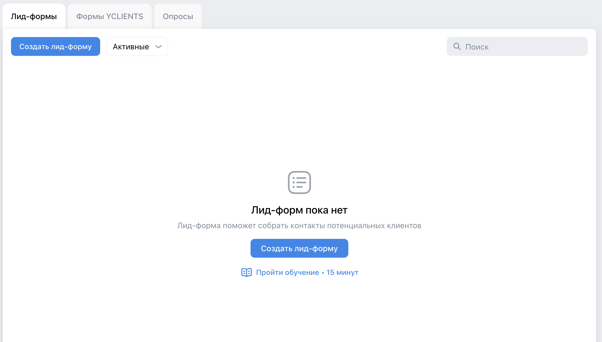
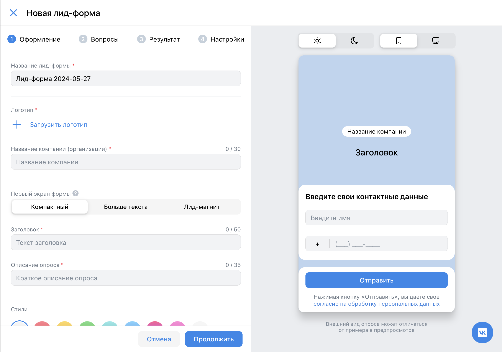
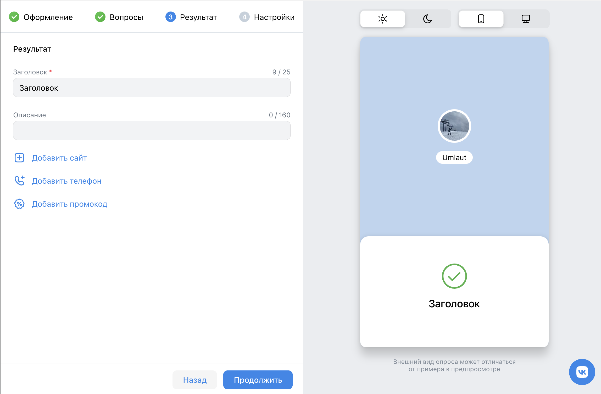
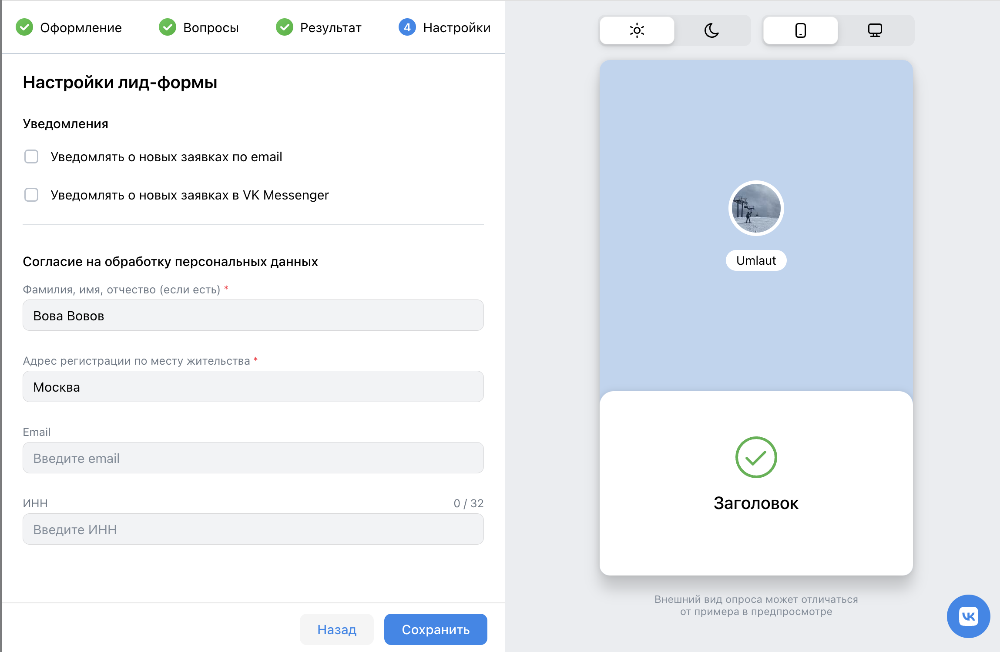
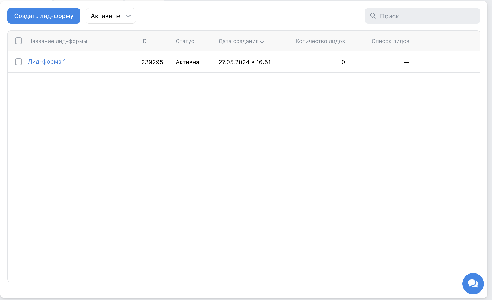
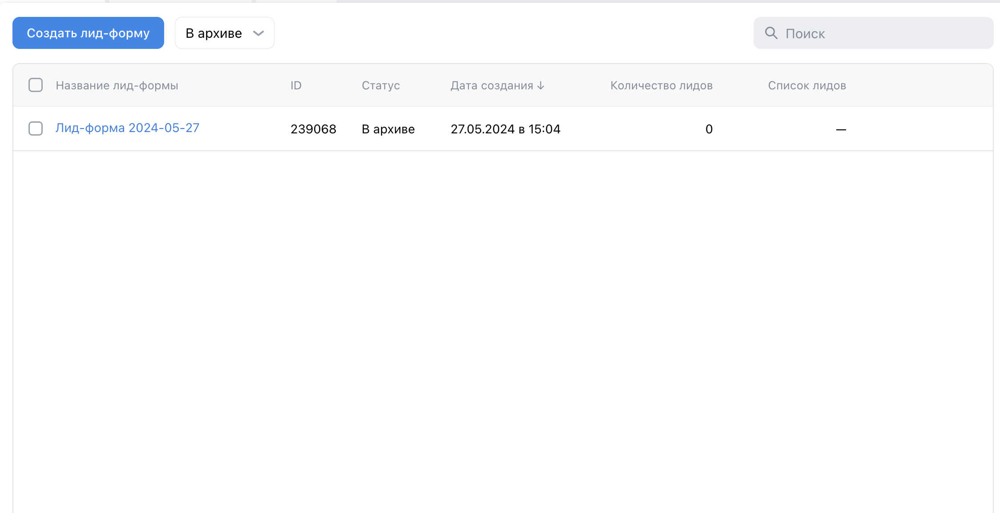

# Чек-листы ads.vk.com

## [Лид-формы](https://ads.vk.com/hq/leadads/leadforms)

При открытии страницы отображается кнопка `Создать лид-форму`, кнопка выбора отображения лид-форм (активные, в архиве) и поиск по лид-формам
  
При нажатии на кнопку `Создать лид-форму` открывается окно создания лид-формы
1. `Оформление`

При открытии страницы создания лид-формы открывается первый этап `Оформление`, который содержит:
- текстовые поля `Название лид-формы*`, `Название компании*`, `Заголовок*`, `Описание опроса*`
- Кнопка загрузки логотипа `Загрузить логотип*`
- Кнопки выбора `Первый экран формы*`
- Кнопки `Отмена` и `Продолжить`
При нажатии кнопки `Загрузить логотип` открывается модальное окно `Медиатека`, в котором можно либо загрузить данные с компьютера, либо приложить фотографию, которая уже использовалась раньше

Заполняем данные:
- `Название лид-формы*` - "Лид-форма 1"
- `Загрузить логотип*` - фотография, которая уже использовалась раньше (подгружаем заранее)
- `Название компании` - "Umlaut"
- `Первый экран формы` - "Компактный"
- `Заголовок` - "Заголовок 1"
- `Описание опроса` - "Описание 1"
При нажатии кнопки `Продолжить` происходит переход на следующий этап `Вопросы`
  
2. `Вопросы`

При переходе на вкладку `Вопросы` отображается следующие поля:
- Кнопка `Добавить вопрос`
- Кнопка `Добавить контактные данные*`
При нажатии кнопки `Добавить вопрос` отображается окно с полями:
- текстовое поле `Напишите вопрос`
- текстовое поля `Введите ответ`
- селектор `Тип вопроса` - "Выбор одного ответа", "Выбор нескольких ответов", "Ответ в произвольной форме"
- кнопка `Добавить ответ`
  
Заполняем данные:
- `Добавить вопрос`:
  - `Напишите вопрос` - "Вопрос 1"
  - `Тип вопроса` - "Выбор одного ответа"
  - `Введите ответ` - "Ответ 1", "Ответ 2"
  - кнопка `Добавить ответ` - "Ответ 3"
- `Контактные данные` - "Имя", "Номер телефона"
При нажатии кнопки `Продолжить` происходит переход на следующий этап `Результат`
При нажатии кнопки `Назад` происходит переход на предыдущее окно лид-формы
  
3. `Результат`

При переходе на вкладку `Результат` отображается следующие поля:
- текстовое поле `Заголовок*`
- текстовое поле `Описание*`
- кнопка `Добавить сайт`
- кнопка `Добавить телефон`
- кнопка `Добавить промокод`

Заполняем данные:
- `Заголовок` - "Спасибо за ответы!"
- `Описание` - "Заявка отправлена"
При нажатии кнопки `Продолжить` окно создания лид-формы переходит на следующий этап `Настройки`
При нажатии кнопки `Назад` происходит переход на предыдущее окно лид-формы
  
4. `Настройки`

При переходе на вкладку `Настройки` отображается следующие поля:
- булевое поле `Уведомлять о новых заявках по email`
- булевое поле `Уведомлять о новых заявках в VK Messenger`
- текстовое поле `Фамилия, имя, отчество (если есть)*`
- текстовое поле `Адрес регистрации по месту жительства*`
- текстовое поле `Email`
- текстовое поле `ИНН`

Заполняем данные:
- `Фамилия, имя, отчество (если есть)` - "Селениум Вова Селениумович"
- `Адрес регистрации по месту жительства` - "Москва, Селениумов проезд, дом 3"
При нажатии кнопки `Сохранить` созданная лид-форма появляется в списке активных лид-форм
При нажатии кнопки `Назад` происходит переход на предыдущее окно лид-формы
  

После создания лид-формы открывается главная страница лид-форм со следующими полями:
- список лид-форм
- селектор выбора типа лид-формы - `Активные`, `В архиве`
  
- При наведении курсора на "Лид-форма 1" и нажатии кнопки `Редактировать` откроется модальное окно `Редактирование Лид-формы` с введенными выше данными

- При поиске лид-формы "Лид-форма 1" будет найдена созданная лид-форма
- При поиске лид-формы "Неизвестная лид-форма" появится надпись `Ничего не нашлось`
- При переключении кнопки `Активные` на `В архиве` будут отображены архивированные лид-формы

- При выделении активной лид-формы и выборе действия удалить и нажатии кнопки `Удалить` лид-форма будет перемещена в архив
- При выделении архивированной лид-формы и выборе действия восстановить и нажатии кнопки `Восстановить` лид-форма будет перемещена в активные

## [Регистрация](https://ads.vk.com/hq/registration)

- При нажатии на `Создать новый кабинет` происходит переход на страницу регистрации кабинета ([https://ads.vk.com/hq/registration/new](https://ads.vk.com/hq/registration/new))
- При нажатии на `Использовать рекламный кабинет myTarget` происходит переход на страницу авторизиции в кабинет myTarget ([https://ads.vk.com/hq/registration/import/target](https://ads.vk.com/hq/registration/import/target))
- При нажатии на `Войти через Mail.ru` происходит переход на форму входа в Mail.ru ([https://account.mail.ru/login](https://account.mail.ru/login))

### [Регистрация кабинета](https://ads.vk.com/hq/registration/new)

При открытии отображается форма заполнения данных для кабинета (см. выше) и кнопка `Создать кабинет`

- При вводе email "selenium@mail.ru", ИНН "123123123123", выборе валюты "Российский рубль (RUB)", установке флага `Создавая кабинет, вы принимаете условия` и нажатии на `Создать кабинет` происходит создание кабинета и переход на страницу компаний
- При нажатии на флаг `Агенство` автоматически убирается флаг `Рекламодатель`
- При выборе страны автоматически выбирается тип валюты (`Россия` - `Российский рубль (RUB)`)
- При нажатии на `Создать кабинет` и незаполнении поле `email` появляется надпись "Обязательное поле"
- При некорректном заполнении поля (несоответствии форме xxx@xxx.xxx) `email` появляется надпись "Некорректный email адрес"
- При нажатии на флаг `Физическое лицо` автоматически убирается флаг `Юридическое лицо` и появляются два дополнительных поля: `ИНН`, `ФИО`
- При некорректном заполнении поля (строкой меньше 12 символов) `ИНН`  появляется надпись "Минимальная длина 12"
- При некорректном заполнении поля (строкой больше 12 символов) `ИНН` появляется надпись "Максимальная длина 12 символов"
- При нажатии на `Создать кабинет` и неустановленном флаге `Создавая кабинет, вы принимаете условия` появляется надпись "Обязательное поле"
